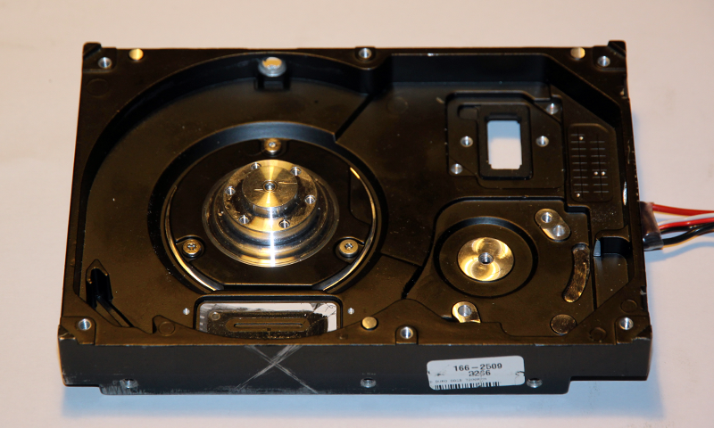
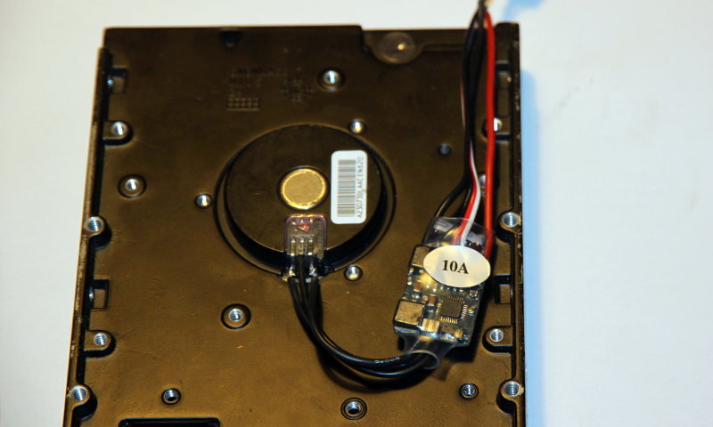
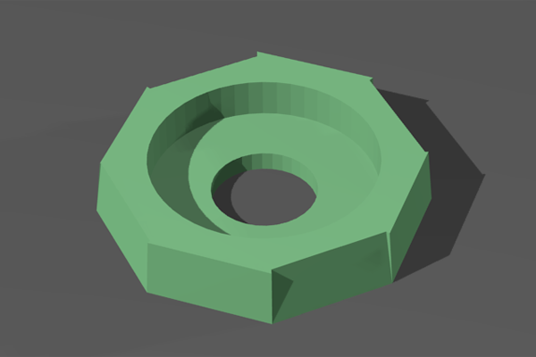
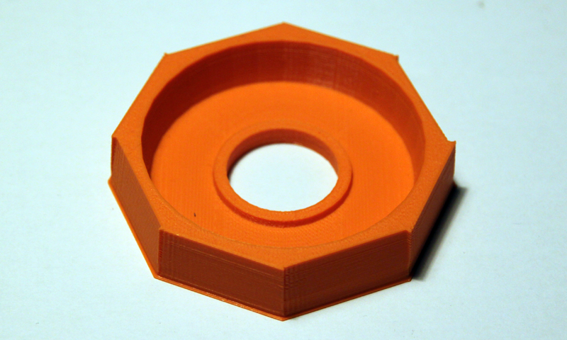
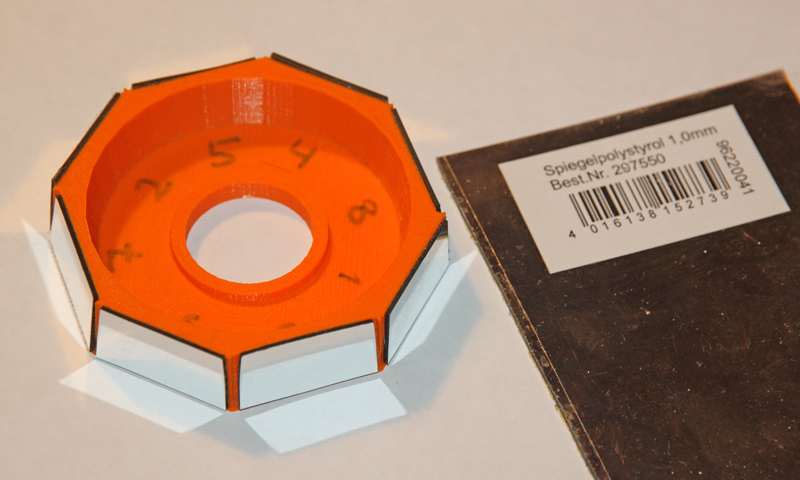
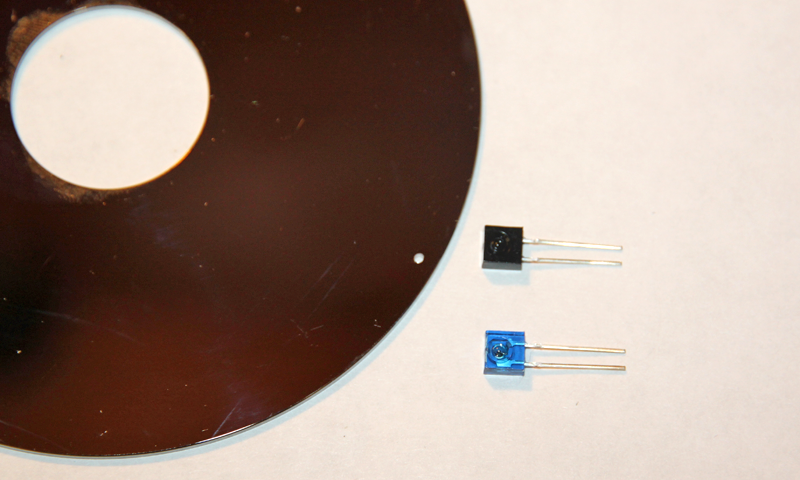
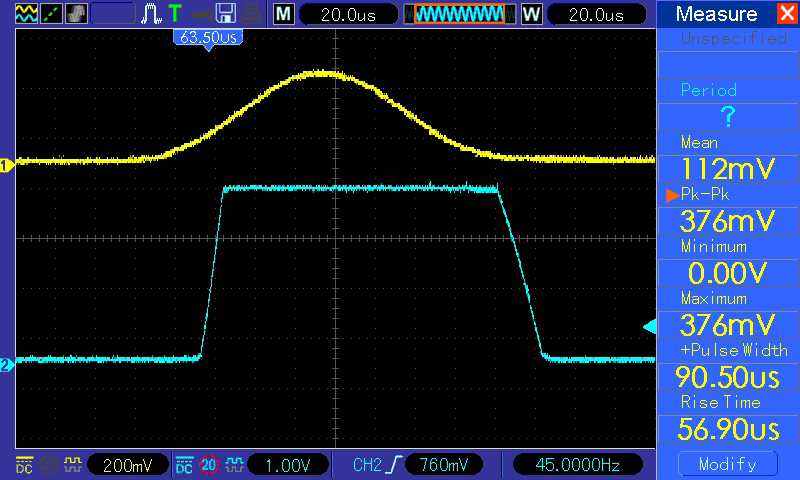
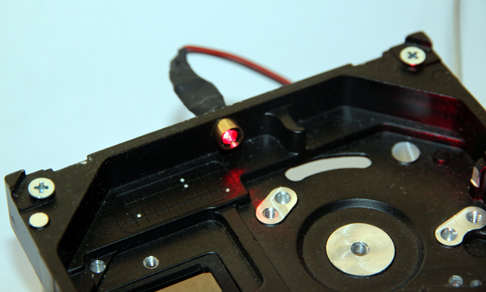
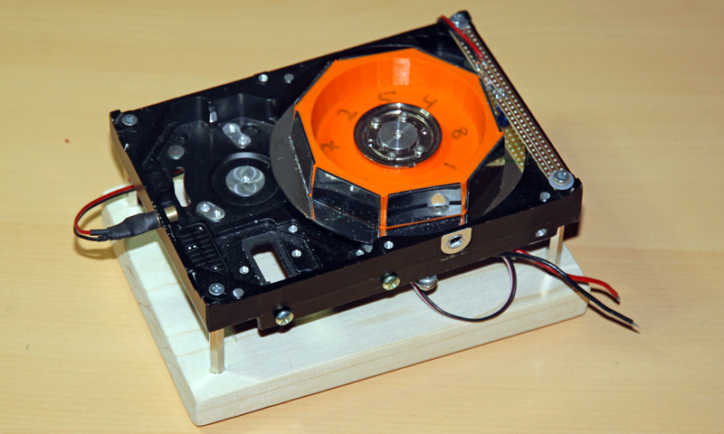
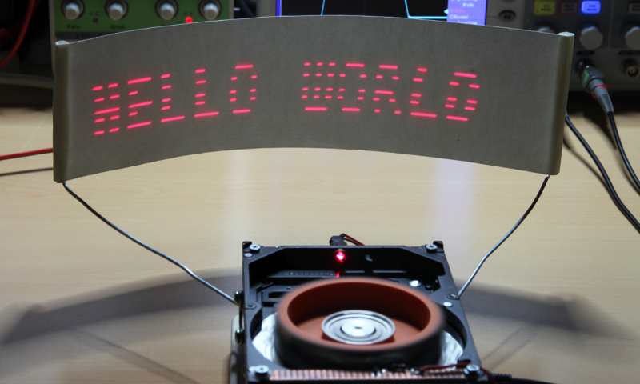

##Laser Projector##

Old hard disk drive with functional motor

Electronic Speed Control unit

3D Model of the rotating octogonal mirror.

Printed Mirror

Finished mirror with reflective stripes 

Light barrier to measure rotation speed 

Analog signal from the light barrier is digitalized by comparator 

Laser LED from a laser ponter 

Assembled projector 

Hello world!

